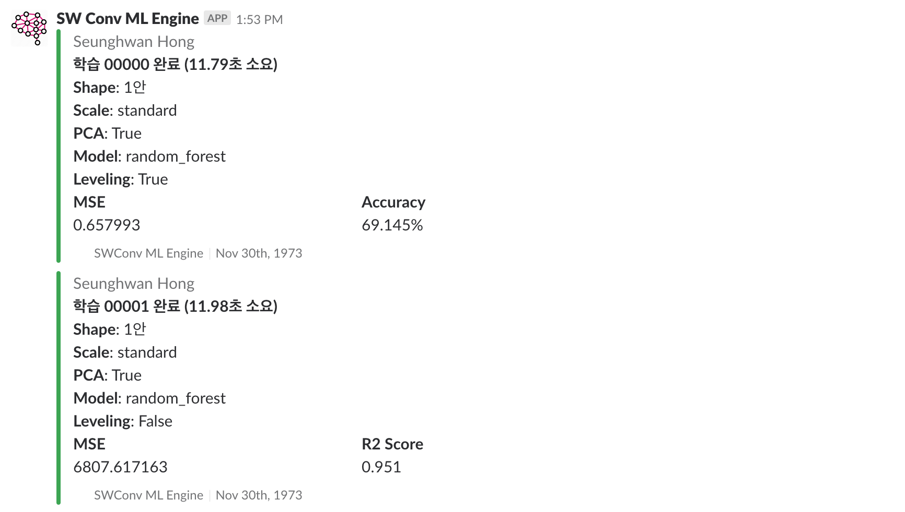

# 모기 활성도와 날씨 데이터의 상관관계 분석

## 개요

특정 날짜당 모기의 활성도 데이터와 날씨 데이터를 바탕으로 회귀 모델을 학습시켜서 서울의 모기 지수를 예측하는 모델을 만드는 프로젝트입니다. Random Forest, SVM Regression, Decision Tree 등의 모델을 사용하며, PCA의 수행 여부나 여러 Scaler의 사용 등을 쉽게 바꾸어 실험해볼 수 있는 일종의 라이브러리입니다.



> 본 프로젝트는 국민대학교에서 진행하는 소프트웨어융합최신기술 강의의 과제로써 만들어진 프로젝트입니다.

## 사용 가능한 기능

* Dataset AutoLoad & Abstraction
  * 별도 관리 없이 자동으로 Trainset, Testset Split
  * Feature List, Label List에 대한 Numpy Array 자동 변환
* Dataset Management
  * 1안, 2안, 3안, 4안 변환에 대한 추상화 클래스 및 함수
* Regression Model
  * Random Forest
  * Decision Tree
  * SVM Regression
* PCA (주성분 분석)
* Data Scaling
  * Standard
  * Robust
  * Min-max
  * Normalize
* 학습 상황 Slack Notification
* Visualization
  * 현재 구현 중

## 준비

구동을 위해서는 Python 3.5 이상이 필요합니다.

```bash
pip3 install -r requirements.txt
```

## 실행

라이브러리 내부의 함수들과 클래스들을 읽고 원하는 형태로 구성하여 실행하십시오. 별도의 실행 코드는 첨부되어있지 않습니다. Jupyter Notebook 등의 iPython 환경에서 사용할 수 있도록 준비하고 있습니다.